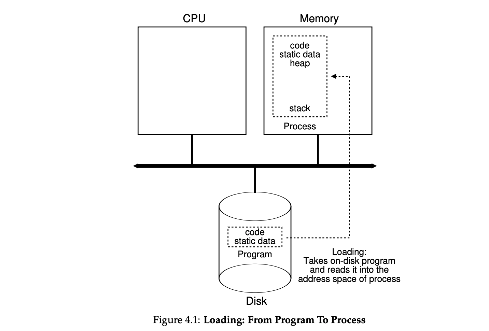

# 1. The Abstraction: The Process

## 어떻게 무한한 수의 CPU를 제공하는 것 같은 환상을 만들어낼 수 있을까?

- 답) CPU를 가상화한다.
- 시분할(time-sharing):
  - 한 프로세스를 실행하고, 얼마 후 중단시키고 다른 프로세스를 실행하는 작업을 반복한다.
  - CPU를 공유하기 때문에, 각 프로세스의 성능은 낮아진다.
- 운영체제에서 CPU 가상화를 구현하기 위해서는 (1) low-level의 `도구(machinery)`와 (2) high-level의 `지능(intelligence)`이 필요하다.
  - (1) low-level의 `도구(machinery)`
    - low-level machinery를 메커니즘이라고 부른다:
    - 메커니즘은 특정 기능을 구현하기 위한 저수준의 방법이나 프로토콜을 의미한다.
    - ex) context-switch는 OS가 한 프로그램의 실행을 멈추고, 다른 프로그램의 실행을 시작할 수 있도록 해주는 기능이다.
    - time-sharing 메커니즘은 모든 현대 운영체제에서 사용된다!
  - (2) high-level의 `지능(intelligence)`
    - 이러한 메커니즘 위에는 정책(policies)의 형태로 운영체제의 일부 지능이 존재한다.
    - 정책은 운영체제 내에서 특정 결정을 내리기 위한 알고리즘이다.
    - ex) 여러 프로그램이 실행될 수 있는 상황에서 어떤 프로그램을 실행할지. (스케줄링 정책이 이러한 결정을 내린다.)

## 1. 프로세스의 개념

- 프로세스: 실행 중인 프로그램
  - 프로그램 자체는 생명이 없는 정적인 존재로, 단순히 디스크 위에 저장된 명령어와 정적 데이터의 집합일 뿐이다.
  - 운영체제가 이러한 바이트들을 실행하고 변환해서 프로그램을 유용한 것으로 만든다.
- 특정 시점의 프로세스를 간단하게 표현하려면, 실행 중에 접근되거나 변경된 자원의 목록을 작성하면 된다.

### machine state

- 프로세스의 구성 요소를 이해하려면 하드웨어 상태(machine state)를 이해해야 한다.
  - machine state는 프로그램이 실행 중에 읽거나 업데이트할 수 있는 시스템의 상태를 의미한다.
- 메모리
  - 명령어와 읽고 쓰는 데이터는 메모리에 존재하므로 메모리(address space)는 프로세스를 구성하는 요소이다.
- 레지스터
  - 많은 명령어가 레지스터를 명시적으로 읽거나 갱신하므로, 레지스터도 프로세스 실행에 있어 매우 중요한 요소이다.
  - machine state에는 특히 중요한 몇가지 특수 레지스터가 포함되어 있다.
    - PC(program counter = 명령어 포인터, instruction pointer, IP): 프로그램의 어느 명령어가 실행 중인지 알려주는 레지스터
    - stack pointer, frame pointer: 함수의 변수와 리턴 주소를 저장하는 스택을 관리할 때 사용하는 레지스터
- 영구 저장 장치(persistent storage)
  - 이러한 I/O 정보에는 프로세스가 현재 열어 둔 파일 목록 같은 것이 포함될 수 있다.

## 2. 프로세스 API

- 운영체제가 반드시 API로 제공해야 하는 기본기능들
- (1) Create: 새로운 프로세스 생성
- (2) Destroy: 프로세스 강제 종료
- (3) Wait: 특정 프로세스의 실행 중지까지 대기
- (4) Miscellaneous Control (각종 제어): 프로세스를 일시정지하거나 재개하는 등의 기능들
- (5) Status: 프로세스가 얼마 동안 실행되었는지 또는 어떤 상태에 있는지 등의 정보

## 3. 프로세스 생성



- 프로그램은 어떻게 프로세스로 변환되는 것일까?
- (1) 코드와 정적 데이터 로드
  - 프로그램의 코드와 정적 데이터(static data, 초기값을 가지는 변수 등)을 프로세스의 주소 공간인 메모리에 **load**한다.
  - 프로그램은 disk 또는 flash-based SSDs에 특정 실행 파일 형식(executable format)으로 존재한다.
  - 코드와 정적 데이터를 메모리에 탑재하려면 OS가 disk에서 바이트를 읽어서 메모리에 저장해야 한다.
  - lazy loading: 초기 운영체제들은 프로그램 실행 전에 전부 메모리에 load했지만, 현대의 운영체제들은 프로그램을 실행하면서 필요한 부분만 메모리에 load한다.
- (2) run-time stack 할당
  - 프로그램의 실행 중 사용될 run-time stack(실행 시간 스택, 스택)을 위한 메모리를 할당한다.
    - 스택 어따 씀? ex. C 프로그램은 스택을 활용하는 전형적인 구조를 가지고 있다. 로컬 변수 저장, 함수 호출 시 매개변수 전달, 함수 호출 후 복귀 주소 저장을 위해 스택을 사용한다.
  - OS는 이 메모리를 할당해서 프로세스에 제공한다.
  - main 함수의 매개변수(argc, argv)로 스택을 초기화한다.
- (3) heap 할당
  - C 프로그램에서 동적으로 할당된 데이터를 저장하기 위해 사용된다.
  - malloc()을 통해 할당되고 free()를 통해 반환된다.
  - 연결 리스트, 해시 테이블, 트리 등 크기가 가변적인 자료 구조를 위해 사용된다.
- (4) I/O 관련 초기화
  - UNIX 시스템에서 각 프로세스는 기본적으로 세 가지의 열린 file descriptor를 갖는다.
    - STDIN 표준 입력, STDOUT 표준 출력, STDERR 표준 에러
  - 이 디스크립터들을 사용해서 프로그램은 터미널로부터 입력을 읽고 화면에 출력을 프린트하는 작업을 쉽게 할 수 있다.
- (5) 프로그램 실행 준비
  - 프로그램의 entry point인 main() 루틴으로 jump하여 CPU의 제어권을 새롭게 생성된 프로세스에 넘기고, 이로써 프로그램이 실행을 시작하게 된다.

## 4. 프로세스 상태


- 프로세스의 상태
  - Running(실행): 프로세스가 프로세서에서 실행중. 명령어를 실행하고 있는 상태
  - Ready(준비): 프로세스가 실행될 준비가 되어 있지만 대기중인 상태
  - Blocked(대기): 프로세스가 어떤 작업을 수행한 뒤, 다른 이벤트가 발생하기 전까지 실행될 준비가 될 수 없는 상태
    - ex) disk에 대한 I/O 요청 시 프로세스는 Blocked 상태가 되고, Blocked 상태에서는 프로세스가 CPU를 사용하지 않으므로 다른 프로세스가 CPU를 점유할 수 있다.
- OS의 스케줄링 정책에 따라 Running 상태와 Ready 상태 사이를 이동한다.
  - Ready -> Running: 프로세스가 스케줄링되어 CPU를 할당받음
  - Running -> Ready: 프로세스가 비스케줄링(descheduled)되어 CPU를 반환함
  - Running -> Blocked: I/O 요청 등으로 인해 대기 상태가 됨 (요청 완료 등의 이벤트가 발생할 때까지 대기상태가 유지됨)
  - Blocked -> Ready: 이벤트가 발생해 대기 상태에서 벗어남

## 5. 자료 구조

- OS도 하나의 프로그램으로, 자료 구조를 가지고 있다.
- Process List = Task list
  - 실행 중인 모든 프로그램을 관리하는 자료 구조
- Process Control Block = PCB = 프로세스 제어 블록 = Process Descriptor
  - 프로세스 리스트를 구성하는 개별 항목으로, 프로세스에 대한 정보를 저장
  - 각 프로세스에 대한 정보를 담고 있는 C 구조체를 지칭한다.
- Register context (레지스터 문맥)
  - 프로세스가 중단될 때 해당 프로세스의 레지스터값들을 저장하는 자료 구조
  - 이 레지스터 값들을 복원해서 프로세스의 실행을 재개한다.
- xv6(교육 목적의 유닉스 OS) 커널에서 각 프로세스를 추적하기 위해 OS가 필요로 하는 정보들 (👇 설명 아래 코드)
  - Running, Ready, Blocked 외에 다른 상태들이 존재한다.
  - 초기 상태
    - 프로세스가 생성되는 동안의 상태
  - 최종 상태
    - 프로세스가 종료되었지만 메모리에 남아있는 상태
    - 유닉스 기반 시스템에서는 Zombie 상태라고 부른다.
    - 프로세스가 성공적으로 실행했는지를 다른 프로세스(보통은 부모 프로세스)가 검사하는 데 유용하다.
  - 부모 프로세스는 wait() 등의 시스템 콜을 호출해서 자식 프로세스의 종료를 기다린다.
    - 이러한 시스템 콜의 호출은, OS에게 종료된 프로세스와 관련된 자원들을 정리하도록 알리는 역할도 한다.

```c
// 프로세스를 중단하고 이후에 재개하기 위해
// xv6가 저장하고 복원하는 레지스터
struct context {
    int eip;
    int esp;
    int ebx;
    int ecx;
    int edx;
    int esi;
    int edi;
    int ebp;
};

// 가능한 프로세스 상태
enum proc_state {
    UNUSED,
    EMBRYO,
    SLEEPING,
    RUNNABLE,
    RUNNING,
    ZOMBIE
};

// 레지스터 문맥과 상태를 포함하여
// 각 프로세스에 대해 xv6가 추적하는 정보
struct proc {
    char *mem;              // 프로세스 메모리 시작 주소
    uint sz;                // 프로세스 메모리의 크기
    char *kstack;           // 이 프로세스의 커널 스택의 바닥 주소
    enum proc_state state;  // 프로세스 상태
    int pid;                // 프로세스 ID
    struct proc *parent;    // 부모 프로세스
    void *chan;             // 0이 아니면, chan에서 수면
    int killed;             // 0이 아니면 종료됨
    struct file *ofile[NOFILE]; // 열린 파일
    struct inode *cwd;      // 현재 디렉터리
    struct context context; // 프로세스를 실행시키려면 여기로 교환
    struct trapframe *tf;   // 현재 인터럽트에 해당하는 트랩 프레임
};
```
